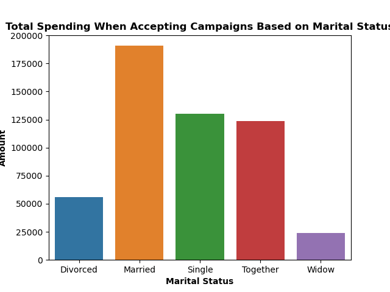

# Python and Pandas: UFood Marketing Data Analysis

#
#### by Alex Melino
#

### Background

The following is a sample project showcasing data analysis techniques for a business problem. The project uses python to clean and analyze data and provide visualizations. A copy of the business problem, objectives and other information seen below can be found in the 'Resources' folder of this repo as 'UFood Data Analyst Case.pdf'. In that folder is also the data set, 'u_food_marketing.xlsx', and a dictionary for column titles, 'ufood_marketing_Dictionary.png'.

The analysis is done with Python with the following required libraries: pandas, seaborn, and matplotlib. 

Below is the business problem summary:

### UFood Marketing Analysis Case

UFood is the lead food delivery app in Brazil, present in over a thousand cities.
Keeping a high customer engagement is key for growing and consolidating the company’s
position as the market leader.
Data Analysts working within the data team are constantly challenged to provide insights and
value to the company through open scope projects. This case intends to simulate that.
In this case, you are presented a sample dataset, that mocks metainformation on the customer
and on UFood campaign interactions with that customer.
It is your challenge to understand the data, find business opportunities & insights and to propose
any data driven action to optimize the campaigns results & generate value to the company.
You should consider that you have to present your results to both technical and business
stakeholders.

#### Key Objectives:
1. Explore the data – don’t just plot means and counts. Provide insights, define cause and
effect. Provide a better understanding of the characteristic features of respondents;
2. Propose and describe a customer segmentation based on customers behaviors;
3. Visualize data and provide written reasoning behind discoveries;

#### The Company

Consider a well-established company operating in the retail food sector. Presently they have
around several hundred thousands of registered customers and serve almost one million
consumers a year. They sell products from 5 major categories: wines, rare meat products, exotic
fruits, specially prepared fish and sweet products. These can further be divided into gold and
regular products. The customers can order and acquire products through 3 sales channels: physical
stores, catalogs and company’s website. Globally, the company had solid revenues and a healthy
bottom line in the past 3 years, but the profit growth perspectives for the next 3 years are not
promising... For this reason, several strategic initiatives are being considered to invert this
situation. One is to improve the performance of marketing activities, with a special focus on
marketing campaigns.

#### The Marketing Department

The marketing department was pressured to spend its annual budget more wisely. Desirably, the success
of these activities will prove the value of the approach and convince the more skeptical within the
company

#### Marketing Dictionary

#
#

### Data Exploration and Cleaning

A few data cleaning steps were needed to prepare the data for analysis and visualization. First, all duplicate rows were dropped, this was a total of 184 rows of data.

Then, categorical columns that made up the information pertaining to marital status, education level, number of children in the home, and accepted marketing campaigns were consolidated into numerical values so that they can be easily analyzed for correlation to other numerical column data. 

The code for these data cleaning steps was as follows:

The final step was to create a column that separated each customer into age brackets. This would allow for easy customer categorization across the age ranges and would allow for easy visualization of patterns or trends with respect to age. 

The code for this was as follows:

#

### Analysis and Visualization

The first analysis was done on the age groups. Visualizations were created for campaign acceptance rate by age, percentage of total customers by age, amount spent per age group, and amount spent when accepting marketing campaigns by age group. 

These are the visualizations that were generated for these metrics:

These plots showed that younger and older people accepted campaigns at a higher rate (but with wider confidence levels), but middle-aged people by far made up the bulk of volume for purchasing.

Next, the analysis moved on to types of purchase. The three types, web purchases, catalogue purchases, and in-store purchases, were visualized, both for total sales and by sales when accepting marketing campaigns. 

The plots for these metrics are below:

These plots show the same pattern for both total spending, and spending when exposed to marketing campaigns.

Next, the number of children in the household was analyzed and similar visualization for this metric were also generated:

These plots showed something curious in the data, which is that as number of children in the household increased, the spending, both total and on accepted campaigns, decreased. Therefore, childless household were spending more. 

Next, spending habits based on the education level was analyzed:

These regression plots show a very minor correlation between higher education level and higher spending.

Lastly, the marital status was analyzed:

Widowed and divorced people made up a much smaller subset of the data, so the spending patterns were clustered around single, together , and married people. Married people spent the most in both analyzed categories.

#

### Overall Findings and Recommendations

1. Age - 30-69 were spending more money but less likely to accept campaigns, but there was higher volume here though which should be taken into consideration.

2. Catalogue customers were more likely to accept campaigns, but in-person customers spent more. To capture benefits from both of these findings, a split between the types is recommended:

    40% catalogue, 30% in-store, 30% web

3. No kids or less kids appeared to spend more and accepted more campaigns. There should be a focus on customers with less kids or no kids when targeting existing revenue sources, or there should be a focus on people with children if the desire is to tap into underutilized markets.

4. Education level had a minor effect on campaign acceptance rate and spending with higher educated people spending only slightly more.

5. Marital status had a minor or negligible effect on campaign acceptance rate and spending.

#### Recommendations for Increased Revenue
- To enhance current operation and get more out of the current bulk of the customer base, there should be a focus on middle aged people, high earners, with no kids. They should be targeted on different platforms with split mentioned above.

#### Recommendations for Untapped Markets
-  To capture new customers and markets, there should be a focus on customers under 30 and over 70 as they accepted campaigns at a higher rate. In addition, marketing to families with children would also help reach a larger market.
